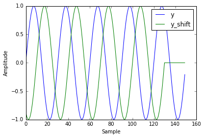

## Shift signal in frequency domain

We need shift an signal for many cases, i.e. when we calculate cross correlation between signals, when we do beamforming to find out the direction of the energy comes, when we use back-projection to track the source of an earthquake, etc. One easy way to shift the signal is in the frequency domain. In this blog, I will show you how to shift an signal in the freuqnecy domain. 

### The theory behind it

When we do a Fast Fourier Transform (FFT), we actually map a finite length of time domain samples into an equal length sequence of frequency domain samples. 

$$X[k]=\sum_{n = 0}^{N−1}  x[n]e^{\frac{−j2πnk}{N}}=A_ke^{jϕ_k}$$

A property of the Fourier transform is that, a delay in the time domain maps to a phase shift in the frequency domain. For the DFT, this property is:

$$x[n]↔X[k]$$

$$x[n−D]↔e^{\frac{−j2πnkD}{N}}X[k]$$

This is to say, if we delay our input signal by D samples in the time domain, it is equavalent to each complex value in the FFT of the signal is multiplied by the constant $$e^{\frac{−j2πnkD}{N}}$$.


```python
%pylab inline
import matplotlib.pyplot as plt
import numpy as np
```

    Populating the interactive namespace from numpy and matplotlib


```python
def nextpow2(i):
    '''
    Find the next power 2 number for FFT
    '''
    
    n = 1
    while n < i: n *= 2
    return n

def shift_signal_in_frequency_domain(datin, shift):
    '''
    This is function to shift a signal in frequency domain. 
    The idea is in the frequency domain, 
    we just multiply the signal with the phase shift. 
    '''
    Nin = len(datin) 
    
    # get the next power 2 number for fft
    N = nextpow2(Nin +np.max(np.abs(shift)))
    
    # do the fft
    fdatin = np.fft.fft(datin, N)
    
    # get the phase shift, shift here is D in the above explaination
    ik = np.array([2j*np.pi*k for k in xrange(0, N)]) / N 
    fshift = np.exp(-ik*shift)
        
    # multiple the signal with shift and transform it back to time domain
    datout = np.real(np.fft.ifft(fshift * fdatin))
    
    # only get the data have the same length as the input signal
    datout = datout[0:Nin]
    
    return datout
```

## Example


```python
Fs = 150.0;  # sampling rate
Ts = 1.0/Fs; # sampling interval
t = np.arange(0,1,Ts) # time vector

ff = 5;   # frequency of the signal

# let's generate a sine signal
y = np.sin(2*np.pi*ff*t)

# shift the signal in the frequency domain by 20 samples
y_shift = shift_signal_in_frequency_domain(y, -20)

plt.plot(y, label = 'y')
plt.plot(y_shift, label = 'y_shift')
plt.xlabel('Sample')
plt.ylabel('Amplitude')
plt.legend()
plt.show()
```





### References
Good explaination at stackexchange:
http://dsp.stackexchange.com/questions/509/what-effect-does-a-delay-in-the-time-domain-have-in-the-frequency-domain
