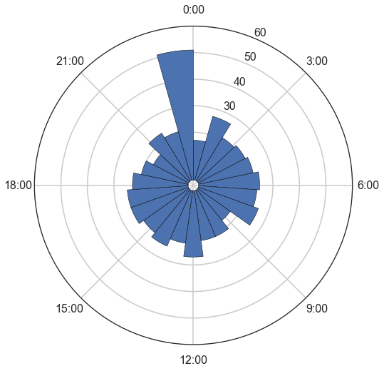

Today I want to plot a histogram on a 24 hour clock (the data is aggregated from real life data that bined on each hour of the day). Here's the code, and you can download the code from Qingkai's Github.


```python
import numpy as np
import matplotlib.pyplot as plt
import seaborn as sns
sns.set_context('poster')
sns.set_style('white')
%pylab inline
```

    Populating the interactive namespace from numpy and matplotlib


### (1) First generate random data from 0 - 23


```python
arr = np.random.randint(0, 24, size = 500)
```

### (2) Plot on the clock


```python
N = 23
bottom = 2

# create theta for 24 hours
theta = np.linspace(0.0, 2 * np.pi, N, endpoint=False)

# make the histogram that bined on 24 hour
radii, tick = np.histogram(arr, bins = 23)

# width of each bin on the plot
width = (2*np.pi) / N

# make a polar plot
plt.figure(figsize = (12, 8))
ax = plt.subplot(111, polar=True)
bars = ax.bar(theta, radii, width=width, bottom=bottom)

# set the lable go clockwise and start from the top
ax.set_theta_zero_location("N")
# clockwise
ax.set_theta_direction(-1)

# set the label
ticks = ['0:00', '3:00', '6:00', '9:00', '12:00', '15:00', '18:00', '21:00']
ax.set_xticklabels(ticks)

plt.show()
```





```python

```
