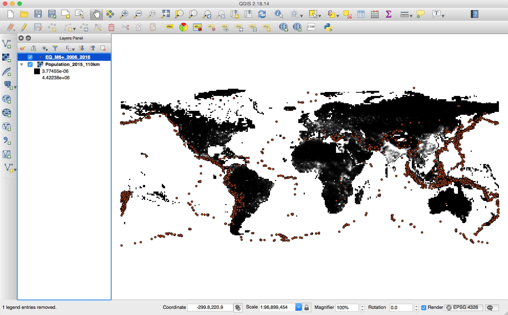
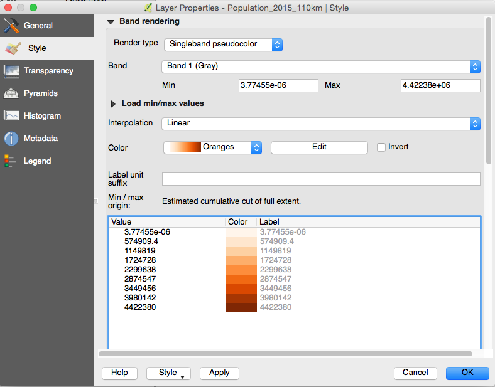
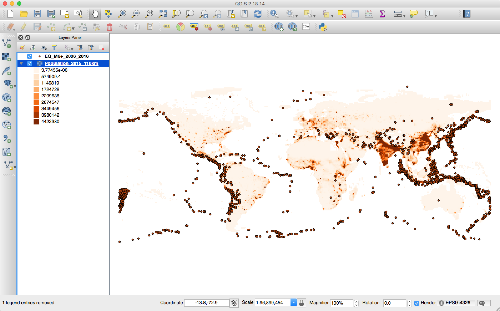
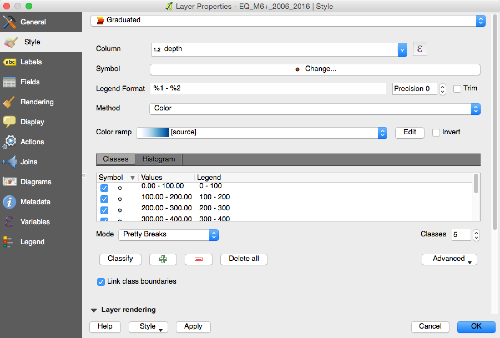
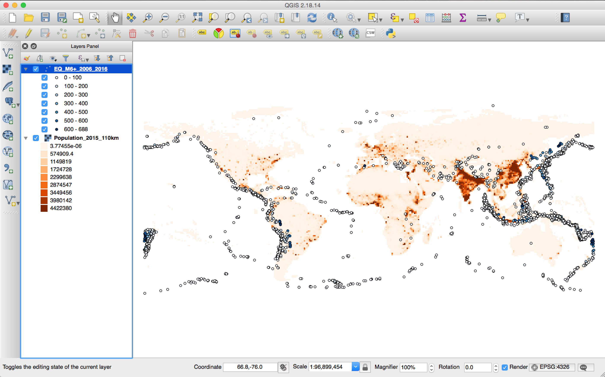
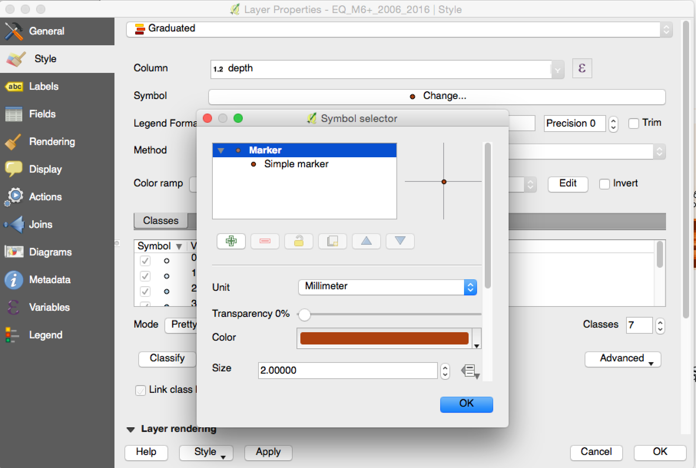
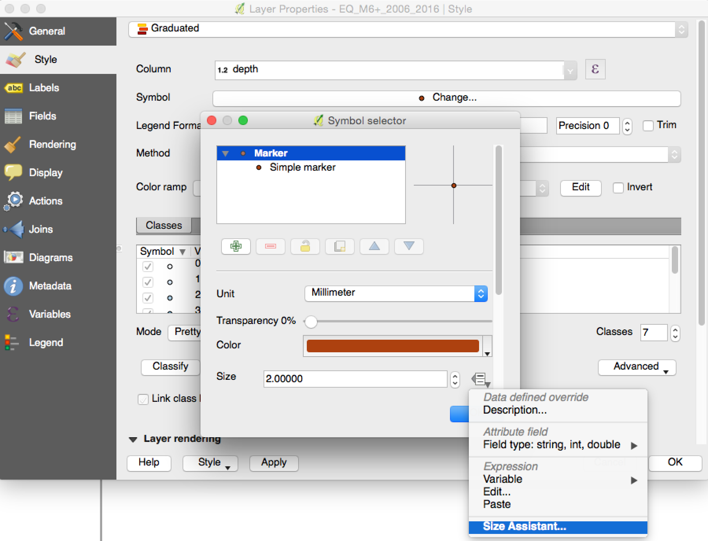
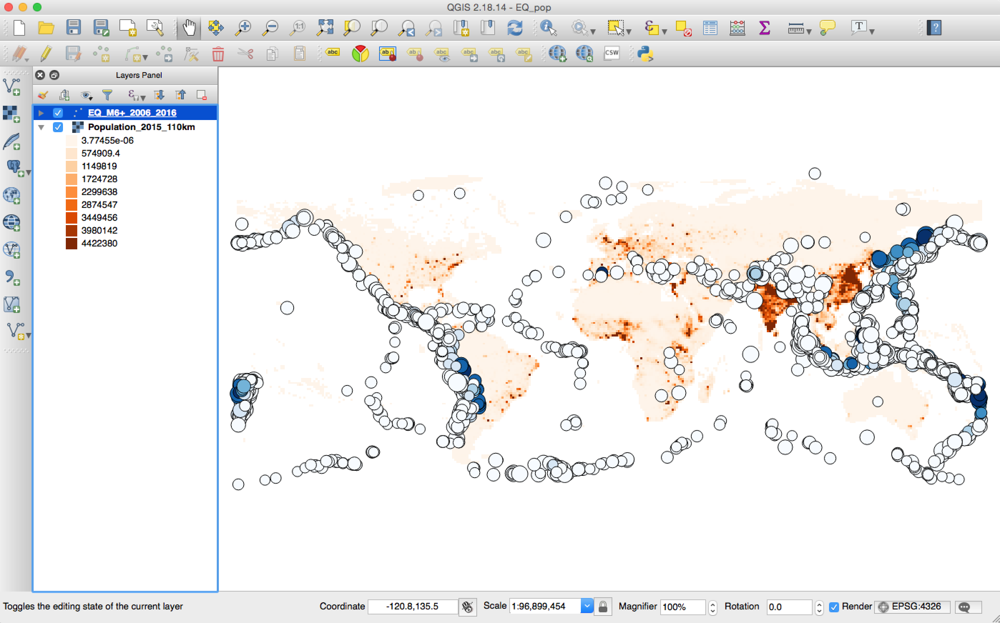
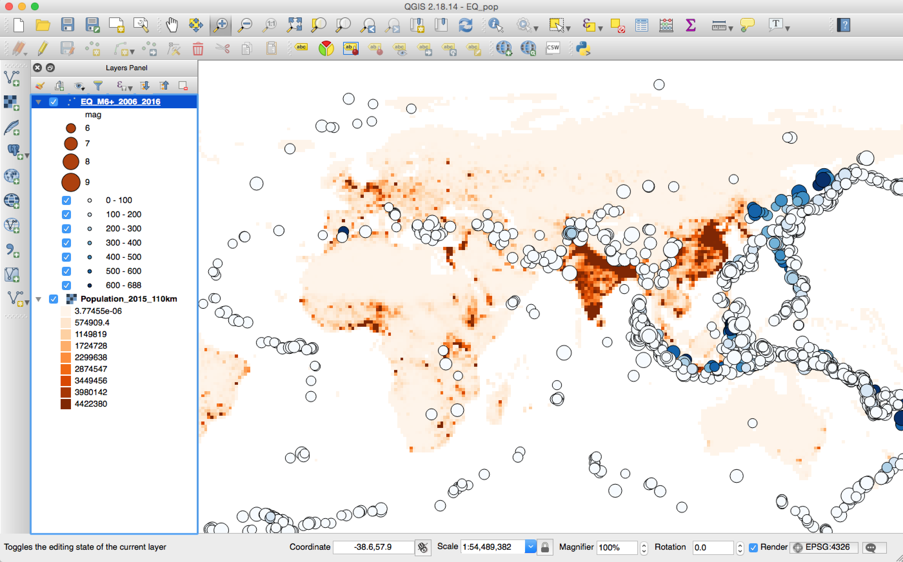

Continue from [last week](), we have the population and earthquake data in QGIS, which looks like the following:

## Change the color of population

We can see that the background population basically is black. The first thing we want to do is to change it so that the population will be shown as different color based on the count of the population. We can achieve this by changing that in the style tab in the properties of this layer (you should remember how to find it, right? Just right click the layer, and choose the properties). 

Let's change the Rneder type to 'Singleband pseudocolor', and change the Color to 'Oranges'. You can see that QGIS will automatically order generate a list of colors based on different population count. Of course, you can click the 'Edit' near the color to change the bins of the divide, that is how many colors you want. Also, you can change value for each color to the one you want to divide, for example, I want the first color is 0, and the 2nd color is 0 to 100. All you need to do is to click the value for the 1st and 2nd value, and change to the values you prefer. Since the automatic values looks good to me, I will not change it here. After you click 'Ok' button, you will see the map showing the population based on the colormap we just selected: the denser the population, the darker red it is, as shown in the following figure.    

## Show depths and magnitude for earthquake data

### change the color  

Now, we want to change the earthquake data as well: we want the color of the circle to show different depths, and the size of the circle to show magnitdue of the earthquake. Basically, we want the deeper the earthquakes are, the darker the colors are, and the larger the size of the circles, the higher magnitudes of the earthquakes. Let's do the color first. We do this in the style tab for the earthquake layer.  

As shown in the above figure, we change the style to 'Graduated', and choose the 'Column' as depth. We also change the method to 'Color', and select the color ramp as we want. This is telling the QGIS that we want to do the graduated color based on the depth column. After this, you can click the 'Classify' button. You will see the different value levels will have a different color. Note that, I select the 'Mode' as Pretty Breaks, you can play with other options or manually change it. Now click 'Ok', you will see the following figure that earthquakes are color-coded with the depth now. 

 

### change the size

Now, let's change the size of the earthquakes. We go back to the style tab in the properties. Click the 'Symbol Change ...', which will bring the Symbol selector as shown in the following figure:

 

Now click the icon on the right of the 'Size', which will bring up a dropdown list. Select the 'Size Assistant...':

 

Change the field to 'mag' and you can also change the 'Size from' and 'Values from' as you prefer, as shown in the following image:

 

After you set the size, and you can see that your earthquakes are now have different sizes based on the magnitude:

Expand the earthquake layer in the 'Layers Panel', you can find your legend there:

Now, you have a nice map of showing the population in different colors and the earthquakes with different depth and magnitude. 
 

