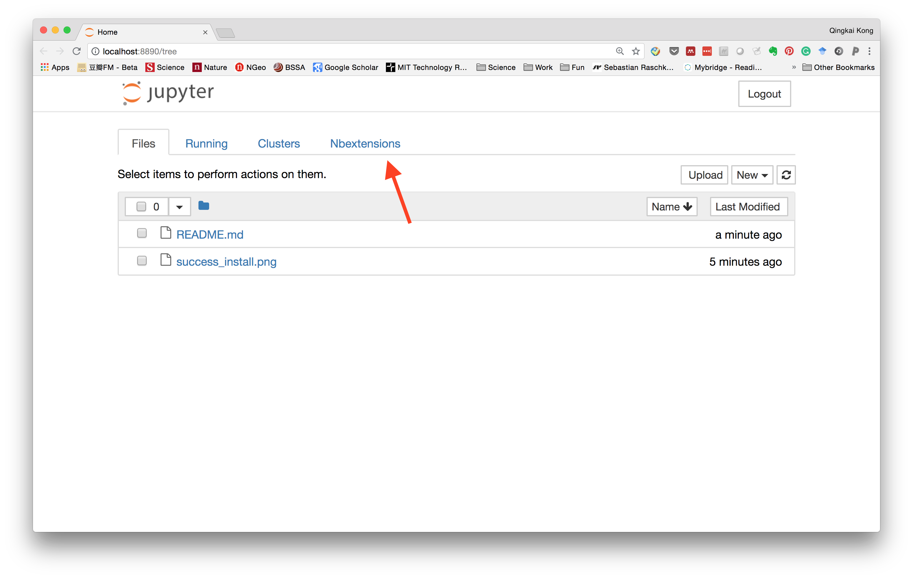
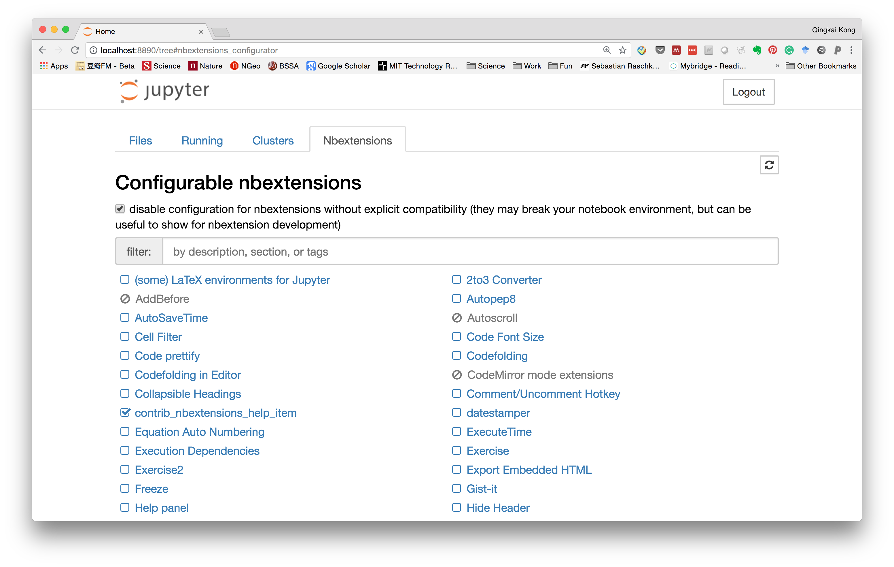
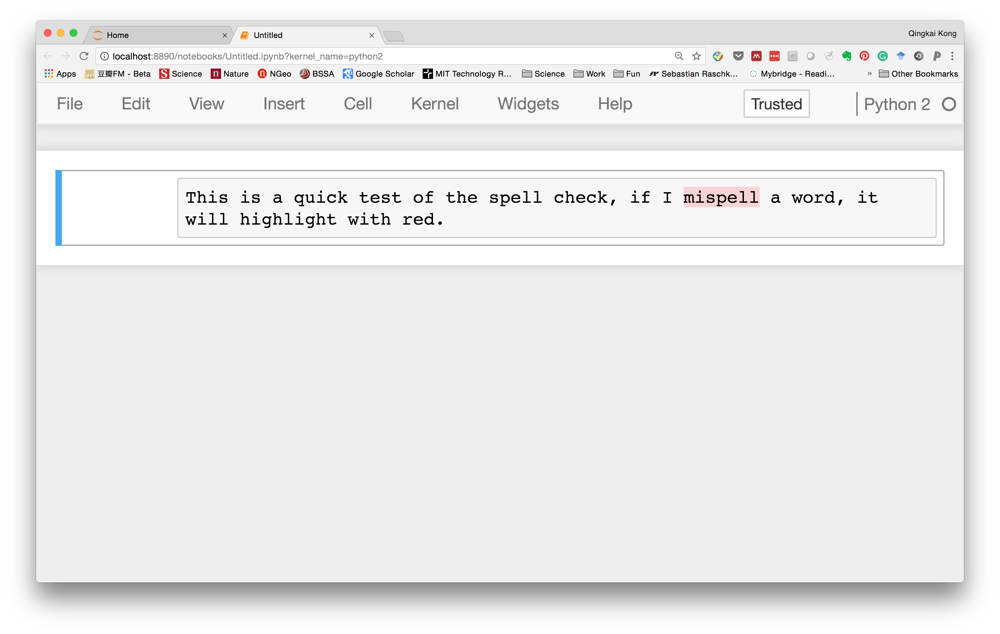

These days, I started to write more and more in Jupyter notebook, not only my blog, but also an entire book within it. Therefore, spell checking is very important to me. But the online grammarly check doesn't work with the notebook, so that I need a new way to do it. 

After googling it, it seems adding the spell check for the markdown cell is easy. It is all based on the discussions here. The basic steps are:

```bash
pip install jupyter_contrib_nbextensions
jupyter contrib nbextension install --user
jupyter nbextension enable spellchecker/main
```

After successfully running the above commands, you should see the screen like this:


Now if you launch the Jupyter notebook, and in the dashboard, you will see a new option for the Nbextensions. 



Within it, you can see all the extensions and the ones you enabled. 



Now, let's go to the notebook, and type something in a markdown cell, we could see that it can highlight the word we misspelled. 


