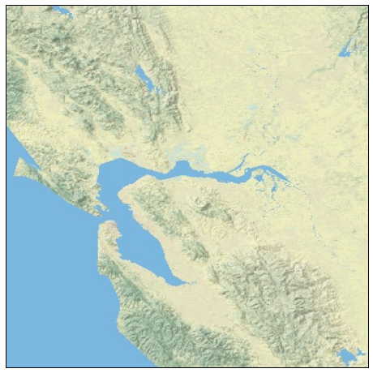
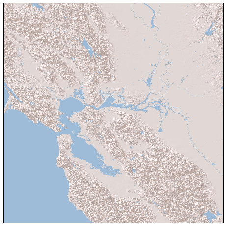
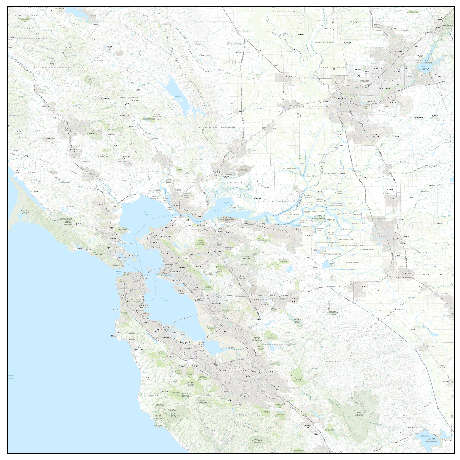
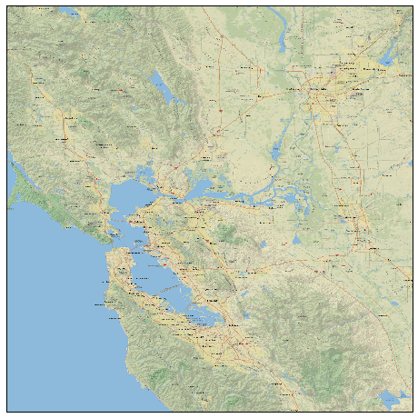
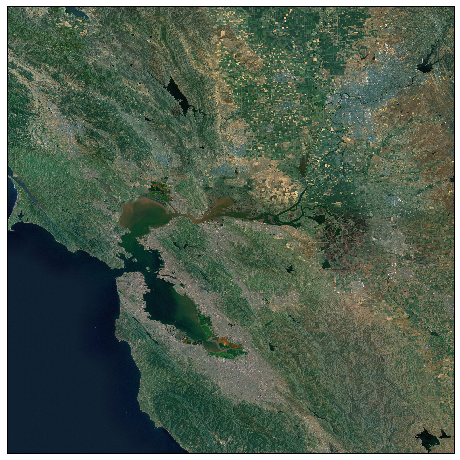
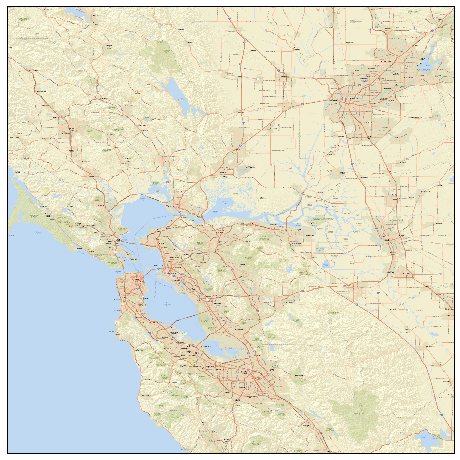
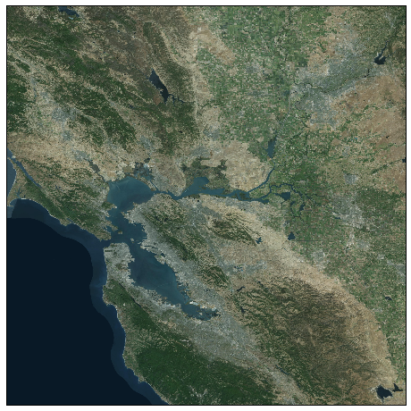
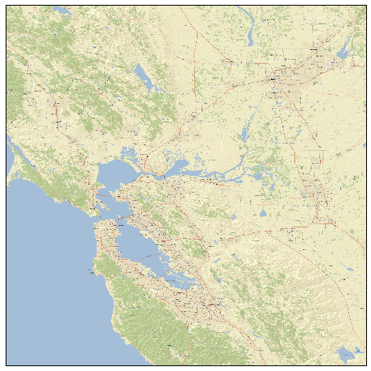
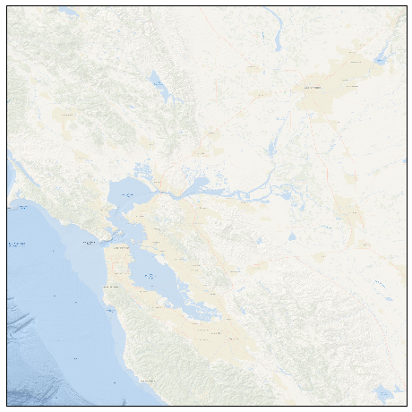

When using python [Basemap](http://matplotlib.org/basemap/users/examples.html) to plot maps, a nice background would be a big plus. But when using map.bluemarble(), map.etopo(), or  map.shadedrelief(), we can not zoom in to a smaller region, since it will generate a blur image. The best way to create a high resolution background image (either topography, street map, etc.) is using **arcgisimage** method. See the documentation [here](https://basemaptutorial.readthedocs.io/en/latest/backgrounds.html). I will show the following examples to plot the nice map.

For using arcgisimage method, you need specify the epsg for different region, and choose the services from the following list (see different services [here](http://server.arcgisonline.com/ArcGIS/rest/services), also [here](http://resources.arcgis.com/en/help/arcgis-rest-api/#/Basemaps/02r3000001mt000000/)):
1. World_Physical_Map
2. World_Shaded_Relief
3. World_Topo_Map
4. NatGeo_World_Map
5. ESRI_Imagery_World_2D
6. World_Street_Map
7. World_Imagery
8. ESRI_StreetMap_World_2D
9. Ocean_Basemap

Which map background do you like? You can download the script as usually at Qingkai's Github. 


```python
%matplotlib inline
from mpl_toolkits.basemap import Basemap
import matplotlib.pyplot as plt
```


```python
# let's first define a helper function to plot the map of Bay Area in US. 

def plot_map(service = 'World_Physical_Map', epsg = 4269, xpixels = 5000):
    # note, you need change the epsg for different region, 
    #US is 4269, and you can google the region you want
    plt.figure(figsize = (8, 8))
    m = Basemap(projection='mill',llcrnrlon=-123. ,llcrnrlat=37,
        urcrnrlon=-121 ,urcrnrlat=39, resolution = 'l', epsg = epsg)
    
    # xpixels controls the pixels in x direction, and if you leave ypixels
    # None, it will choose ypixels based on the aspect ratio
    m.arcgisimage(service=service, xpixels = xpixels, verbose= False)
    
    plt.show()
```

## 1 - World_Physical_Map


```python
plot_map(service = 'World_Physical_Map', epsg = 4269)
```





## 2 - World_Shaded_Relief


```python
plot_map(service='World_Shaded_Relief')
```





## 3 - World_Topo_Map


```python
plot_map(service='World_Topo_Map')
```





## 4 - NatGeo_World_Map


```python
plot_map(service='NatGeo_World_Map')
```





## 5 - ESRI_Imagery_World_2D


```python
plot_map(service='ESRI_Imagery_World_2D')
```





## 6 - World_Street_Map


```python
plot_map(service='World_Street_Map')
```





## 7 - World_Imagery


```python
plot_map(service='World_Imagery')
```





## 8 - ESRI_StreetMap_World_2D


```python
plot_map(service='ESRI_StreetMap_World_2D')
```





## 9 - Ocean_Basemap


```python
plot_map(service='Ocean_Basemap')
```




