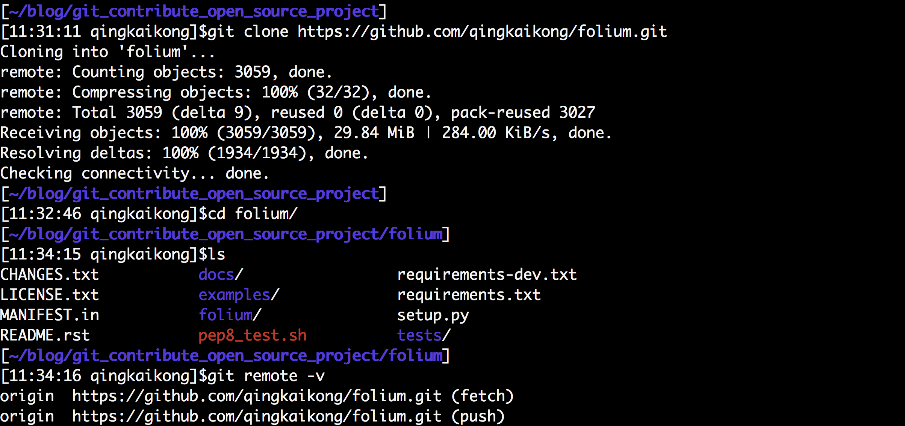
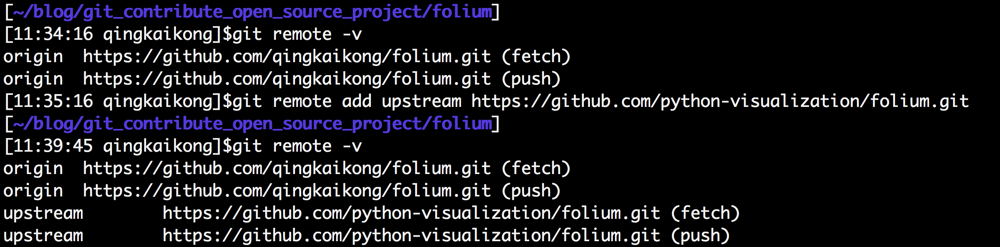
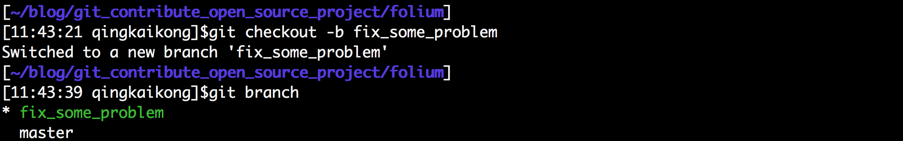
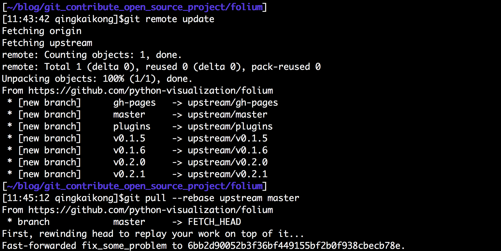
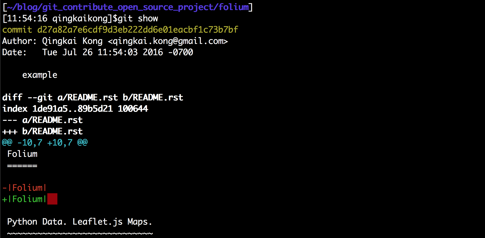
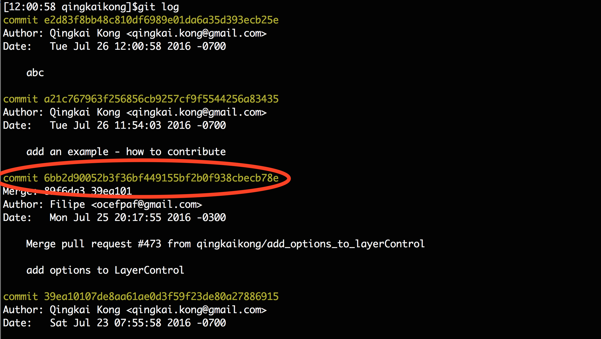
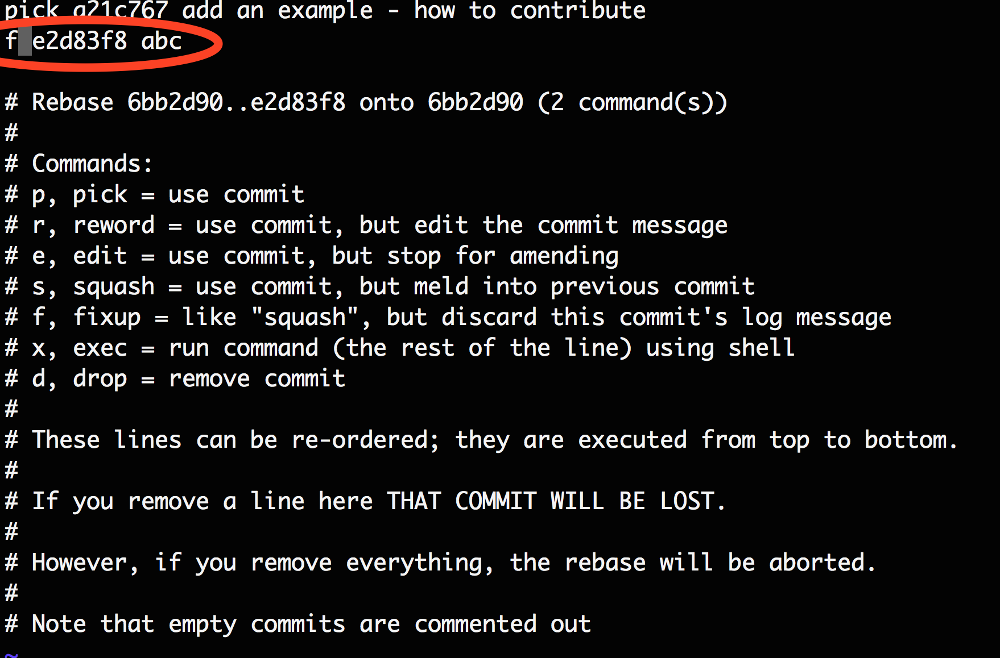
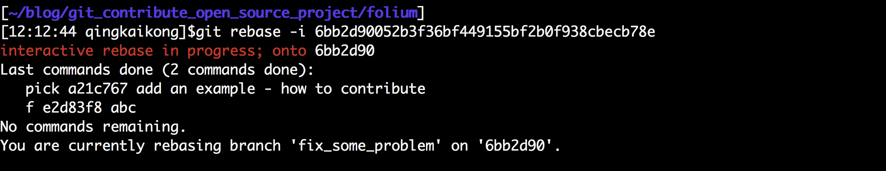

# git workflow to contribute to open source project

[Git](https://git-scm.com/) is a nice version control tool to work with, but how to use it collaboratively with others, and contribute to some open source project using git has a steep learning curve, here, I will summary the main steps how you can contribute to a project.     

There are many ways you can work on a forked repo, i.e. you can either clone it to a virtual environment, or copy it directly to you machine and add it to your path. I like clone the repo directly to my mac, and work inside the folder. Here, I will give a summary of my work flow when contribute to open source projects. I will use [Folium](https://github.com/python-visualization/folium) as an example. 

## Work flow using GIT 

### (1) Fork the project on the github website  

Press the button on the upper right corner (circled by the red), then you will have this repo in your account, it is more like copy it to your own collection, so that you can mess up with it ^)^ without affect the original repo.    

  

---
### (2) git clone the forked repo to your machine  
After you forked the project to your own github, you can now create a version on your laptop. **Note: we clone the repo from the forked version, this will copy the repo from your github to your machine for you to work on**. 

```bash
$ git clone https://github.com/qingkaikong/folium.git
$ cd folium
$ git remote -v
```  

   

---
### (3) Install the package and dependencies  
I usually install the project using pip, and work with the modifications inside this folder. (You can also add it to your path). Note: You also need install the dependencies manually. 

```bash
$ # inside the project folder
$ pip install -e .
```  

  

---
### (4) add the upstream repo, this will let you to sync with the latest update   
Up to this point, we have two copies of the project, one is on your github repo you forked, the other is the one you downloaded to your machine. You can see after you do a git remote -v, it shows your original repo is from 'https://github.com/qingkaikong/folium.git', we need build a mechanism that our repo can link to the original repo, so that we can synchronize with the latest changes made by others. To do this, we add the address point to the original repo, we call it 'upstream'.  

```bash
$ git remote add upstream https://github.com/python-visualization/folium.git
$ git remote -v
``` 

  

---
### (5) Work on a new branch  
Never work on the master branch, but a new branch related with the problem. The reason we work on a new branch will be shown later.  

```bash
$ git checkout -b fix_some_problem
$ git branch
```

   

---
### (6) Finish the modification, add and commit  
Now you can work on the problems you are interested in. After you finish the modification, you can add the changes, and commit it as you usually do.   

```bash
$ git add Some_changes
$ git commit -m 'add changes XXX'
```  

---
### (7) Sync with the upstream master before you push   
Since other people may also work on this project, and merged some new things into the upstream master already, therefore, you need sync with the upstream master before push to avoid conflict. 

```bash
$ # this will get all the latest updates from the upstream repo
$ git remote update
# let's rebase to apply these latest updates to our repo
$ git pull --rebase upstream master
```

  

---
### (8) Push to your remote repo and create a Pull Request (PR)  
Now you can push the changes to your github, and after you do that, you can create a pull request from github. 

```bash
$ git push -u origin fix_some_problem
$ # or you can simply 'git push' and follow the instructions from git
```

---
### (9) Make more changes after PR created   
After you created a PR, anything you commit in this branch from now will be attached to the current PR. For example, after you create this PR, you make some more changes to a file, and commit it as 'commit A'. This commit A will automatically attached to this PR when you push it to github. Therefore, a rule is that: a single branch, will be a single PR. And now, if you want to make some other changes, you should make a new branch from the master (Note: **make a new branch from master! Not from current branch**). If you create a new branch from the current branch (fix_some_problem branch), any commit will be attached to the PR created from this 'fix_some_problem' branch! This is why never work on the master, keep it clean as a base for other modifications. 

```bash
$ git checkout master
$ git checkout -b fix_a_different_problem
```

---
## Some notes before create a PR  

These notes are part of my workflow as well, it is aimed to create better and clearer PR. 

### Check your code before you create a PR  
It is good practice to remove all the unnecessary spaces in your code, you can do this using git show, and the red boxes indicate that you introduced unnecessary spaces that you need delete them. 

```bash 
$ # after you commit, you can check with git show
$ git show
``` 

  	 
### Squash your commit  
Now we see this red boxes that we want to remove it. But you don't want to commit one more time with 'remove unnecessary spaces', since the commit is to show a history of important changes. So the best way to do it is to squash the commit you will make, to do this:

```bash 
# after you commit, you can check with git show
$ vi README.rst
$ # make changes
$ git add README.rst
$ git commit -m 'abc'
$ # show the log history
$ git log
```  
The reason we commit with 'abc' is because we will later squash this commit into the previous one, so you can call it anything.  

  

We can see the following log with the remove spaces fix - 'abc', so we want to squash it to the previous commit - 'add an example - how to contribute'. We want to do a interactive rebase from the commit that circled by the red. 
 
  

```bash 
$ # Let's squash the last two commits
$ git rebase -i 6bb2d90052b3f36bf449155bf2b0f938cbecb78e
```   
The interactive rebase will open the vi editor for you to compile. You can see the top two lines with the last two commits we made. And git gives you command options in the bottom, all you need do is to change the pick to the command you want. 

  

The options are clear, we can either choose 's' to squash, and then delete the 2nd commit, or just fix it using 'f', which ignore the 2nd commit. Let's change this in the editor by change the 'pick' to 'f', and close the editor (see the red circle in the screenshot). 

  

The following is the screenshot after you close the editor:

  

Now if you check git log again:

  

# Acknowledgements  
I learned most of my git skills from:  

* Folks at [Deutsche Telekom Silicon Valley Innovation Center](http://t-labs.us/team.html), they are awesome!!!
* [Filipe Fernandes](http://ocefpaf.github.io/homepage/), I met at Scipy Sprints, he is great, taught me a lot of things \^)^
