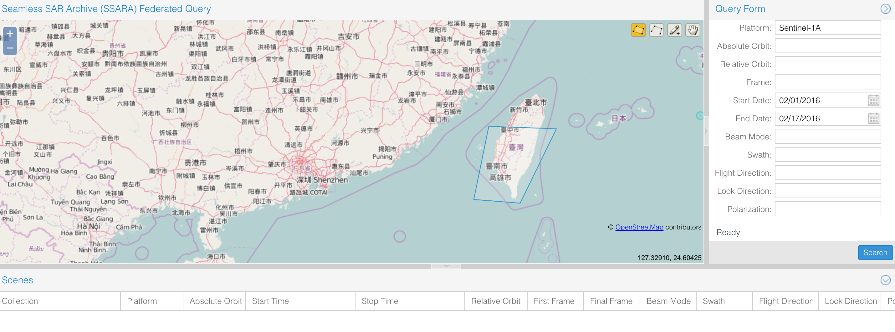
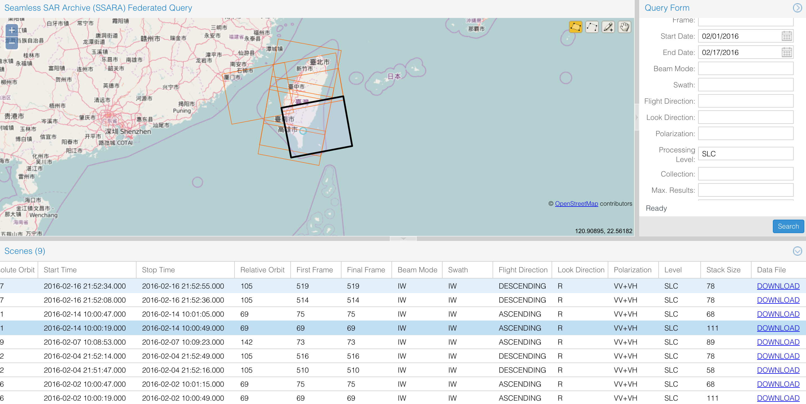
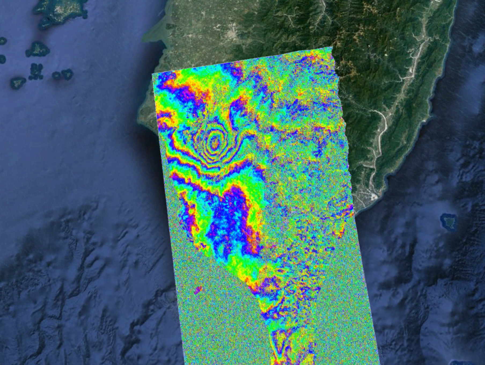
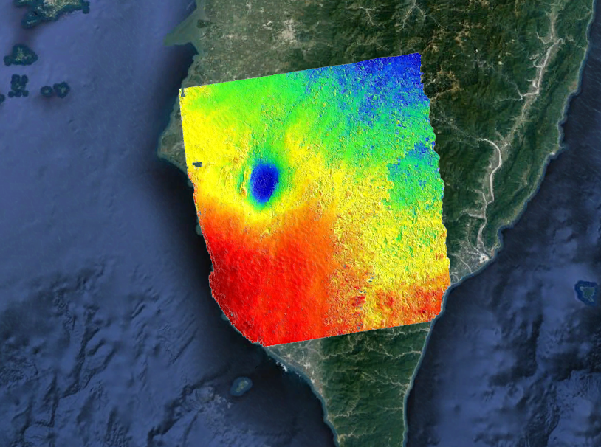

I learned processing [InSAR](https://en.wikipedia.org/wiki/Interferometric_synthetic_aperture_radar) data in the [short course](https://www.unavco.org/education/advancing-geodetic-skills/short-courses/2016/insar-gmtsar/insar-gmtsar.html) at [Scripps](https://scripps.ucsd.edu/) using the [GMTSAR](http://topex.ucsd.edu/gmtsar/). In this blog, I will write down the steps I used to process the [Sentinel-1A](https://en.wikipedia.org/wiki/Sentinel-1A) data for my own reference. I will use the [2016 Taiwan M6.4 Meinong earthquake](https://en.wikipedia.org/wiki/2016_Taiwan_earthquake) as an example.      

## **Step 1 - get data**   
There are multiple ways to get the data. The most common way is to use the [GUI](http://web-services.unavco.org/brokered/ssara/gui) or use the [API](https://github.com/bakerunavco/SSARA) directly. For this earthquake, we will try to use the GUI to download the Sentinel-1A data. We first draw a polygon around the earthquake region as shown in the following figure. Since the earthquake occurred on Feb 5th, we put our search range from Feb 1 - Feb 17. Because we only use the SLC processing level, so I changed the 'Processing Level' to 'SLC'.  
  
After you pressed the search button, you will get a list of available data within the range, shown below. When you select any of the record, it will highlight on the map as the black box. Scroll to the right, you will see the download button two download the data. Because we want to download the data that can reflect the deformation caused by the earthquake, therefore, we need both the data before the earthquake, and after. By looking at the Ascending path, we have Feb 2nd and Feb 14th satisfy the requirement (Note: You should choose both from the same path, either Ascending or Descending). Then go ahead to download the data (about 10 Gb).     
   
## **Step 2 - get the orbit data**  
You also need the orbits data before processing, which you can download it [here](https://www.unavco.org/data/imaging/sar/lts1/winsar/s1qc/aux_poeorb/). The naming of the orbits data is like

``` 
S1A_OPER_AUX_POEORB_OPOD_20160222T121629_V20160201T225943_20160203T005943.EOF
```  
Note there are 3 dates, the first one indicate when it is processed (mostly useless in our example), and the last two dates are the start and end dates of the orbits, and we need make sure our Sentinel data date is within this range. For our case, we need the following two files:  

```
S1A_OPER_AUX_POEORB_OPOD_20160222T121629_V20160201T225943_20160203T005943.EOF  
S1A_OPER_AUX_POEORB_OPOD_20160305T121418_V20160213T225943_20160215T005943.EOF
```  
## **Step 3 - folder structure**  
The next step you need is to put the data into a folder structure for processing. The folder structure looks like the following, and the red color indicate directories, you can see the subdirectory or the files in them. The two .SAFE directories are from the InSAR data you downloaded. And the two files ending with eof.txt are the orbits data we downloaded. For the dem.grd, you can download it from [here](http://topex.ucsd.edu/gmtsar/demgen/) by specify the latitude and longitude. The 01\_run\_prep.sh, 02\_run\_proc.sh, and config.s1a.txt, we will talk in the next section.  
 
<pre>
Taiwan_earthquake
├── 01_run_prep.sh
├── 02_run_proc.sh
├── config.s1a.txt
├── <font color="red">orbits</font>
|   ├── <font color="red">S1A_IW_SLC__1SDV_20160202T100019_20160202T100049_009766_00E469_C190.SAFE</font>
|   ├── <font color="red">S1A_IW_SLC__1SDV_20160214T100019_20160214T100049_009941_00E981_ABD9.SAFE</font>
|   ├── S1A_OPER_AUX_POEORB_OPOD_20160222T121629_V20160201T225943_20160203T005943.eof.txt
|   └── S1A_OPER_AUX_POEORB_OPOD_20160305T121418_V20160213T225943_20160215T005943.eof.txt
└── <font color="red">topo</font>
    └── dem.grd
</pre>

## **Step 4 - change the config file**  
Before you run the following steps, you need consider the settings in the config.s1a.txt file. There are many settings inside, but you can first run with the default setting, and change it later. For more details, you should refer to the [GMTSAR documentation](http://topex.ucsd.edu/gmtsar/tar/GMTSAR_2ND.pdf). My example config.s1a.txt file is here:
### [config.s1a.txt](./Taiwan_earthquake/config.s1a.txt)

## **Step 5 - run the preparation**   
The 01\_run\_prep.sh script should be run first to prepare the data and align the master and slave images. Before you run that, you need change the name of the files inside. Note that the input of the align\_tops\_esd.csh run in the script is: InSAR-1, orbit-1, InSAR-2, orbit-2, dem.grd. Notice that, I only use the polarity 'vv' for this example. See my example file: 
### [01\_run\_prep.sh](./Taiwan_earthquake/01_run_prep.sh).  

After you run this script, you will find you have a updated folder structure, which contains 4 more folders: F1, F2, F3, and raw. The F1, F2, and F3 folder contain the aligned data for the 3 subswaths. 

<pre>
Taiwan_earthquake
├── 01_run_prep.sh
├── 02_run_proc.sh
├── config.s1a.txt
├── <font color="red">F1</font>
|   ├── <font color="red">raw</font>
|   ├── <font color="red">topo</font>
|   └── config.s1a.txt
├── <font color="red">F2</font>
|   ├── <font color="red">raw</font>
|   ├── <font color="red">topo</font>
|   └── config.s1a.txt
├── <font color="red">F3</font>
|   ├── <font color="red">raw</font>
|   ├── <font color="red">topo</font>
|   └── config.s1a.txt
├── <font color="red">raw</font>
|   └── many things here ^_^
├── <font color="red">orbits</font>
|   ├── <font color="red">S1A_IW_SLC__1SDV_20160202T100019_20160202T100049_009766_00E469_C190.SAFE</font>
|   ├── <font color="red">S1A_IW_SLC__1SDV_20160214T100019_20160214T100049_009941_00E981_ABD9.SAFE</font>
|   ├── S1A_OPER_AUX_POEORB_OPOD_20160222T121629_V20160201T225943_20160203T005943.eof.txt
|   └── S1A_OPER_AUX_POEORB_OPOD_20160305T121418_V20160213T225943_20160215T005943.eof.txt
└── <font color="red">topo</font>
    └── dem.grd
</pre>

## **Step 6 - run the processing**   
Now, if everything works fine, you can step into the last step: run the processing script - 02\_run\_proc.sh, again, you need change the name of the files inside the script, and this one is easier. You can find my example file here:
### [02\_run\_proc.sh](./Taiwan_earthquake/02_run_proc.sh). 

## **Results**  
After all the above steps, you will find in each of the subswath folder (i.e., F1, F2, and F3), there are two more folders: intf, SLC. Most of the results figures/data are stored in the intf folder. Here are my results:  
**wrapped fringes:**   
  
**unwrapped:**   
  

## **Acknowledgement**  
Thank:  
[UNAVCO](http://www.unavco.org/) for providing the financial support.  
[GMTSAR developer team](http://topex.ucsd.edu/gmtsar/) for the great workshop.  
[GMT team](https://www.soest.hawaii.edu/gmt/) for great support!  

