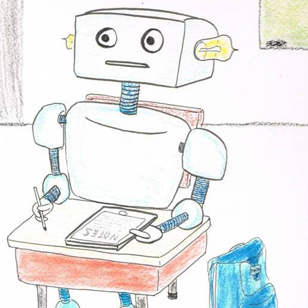
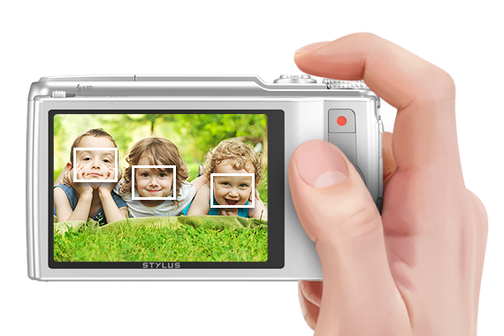
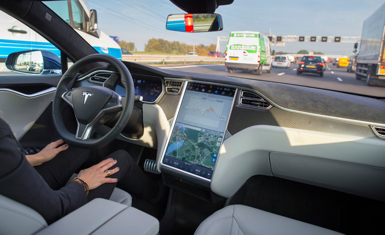
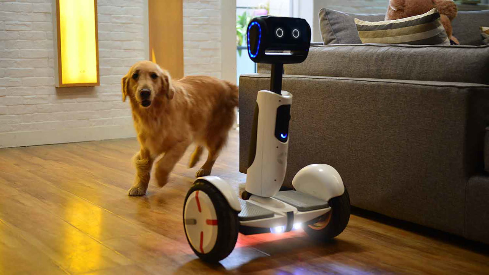

From this week, I will try to explain some basic machine learning concepts and algorithms in a more intuitive way without equations. Note, all these will based on my knowledge of machine learning, therefore, it can be inaccurate or even wrong, feel free to contact me if you find anything wrong, or have a better way to explain. 

Let's start today with the following few questions. 

### What is Machine Learning (ML)?  

As the name suggests, ML is the methods that enable machines or computers to learn from data we give them and then take decisions/actions. The famous definition from [Tom Mitchell's](http://www.cs.cmu.edu/~tom/) book - '[Machine learning](http://www.cs.cmu.edu/afs/cs.cmu.edu/user/mitchell/ftp/mlbook.html)' is more formal if you want it. 

### Real world ML examples  
Think about some daily stuff we take for granted, you will find ML is everywhere: 

#### 1. Why ATM can recognize your handwriting on your check?  

#### 2. Why Amazon can recommend me with good books?  

#### 3. Why the camera can detect my face? 

#### 4. Why some emails be put into spam folder?

#### 5. Why my bank call me about fraud?

#### 6. Why self-driving car can drive by themselvs?

#### 7. Why google search engine can return what I want to search?

#### 8. Why voice assistants (Siri) on my phone understand me?

#### 9. Why advertising can target me correctly?

#### 10. Why home robot is so smart?

All the figures are from internet, I thank the authors for the figures! 
