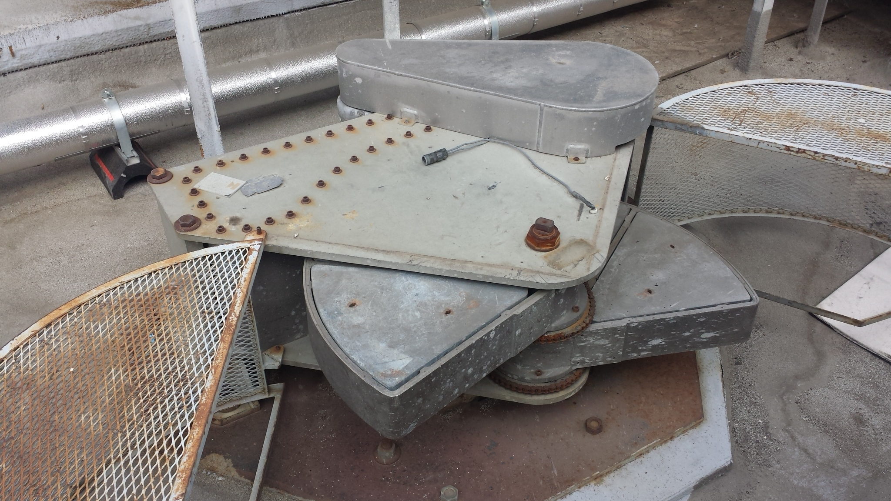

This week, I am visiting Caltech to do a shaker test, which is a test to shake a 9-story building - [The Millikan library](https://upload.wikimedia.org/wikipedia/commons/9/9c/Robert_A._Millikan_Memorial_Library_at_Caltech.jpg), and using sensors to record and measure the response of the building. I am here, because I will put ~30 smartphones on the top of the building, and see if we can use the smartphone to get the fundamental frequency of the building. Also, we will stand on the roof of the building while the shaking, therefore, you will understand that the shaking is not that large, but I was told I can feel the movement of the building for sure.   

## How it works

Ok, I know you must curious how they shake the whole building, and whether they are safe or not. Let me explain this to you. 

First, let's see the building from certain distance:  
  

We know, there are many different things can shake a building, i.e. earthquake, high wind, rain, etc. They all need a force input into the building, for earthquake, the ground movement will introduce a force from the bottom into the building, while for wind, it blows on to the wall of the building, and introduces a lateral force into the building. But for us, how do we introduce a force into the building to shake it? Think about if the building is a toy, and the easiest way is just use your finger to push it on top. But we will not all push the building, instead, we will use something the following device that installed on the top of the building. See the figure below:  
  

You may already have a sense how it works, see the two heavy metal blocks (they call them buckets, which are empty inside, and can be loaded with different configurations of lead weights) in the middle, and they can rotate counter-rotate around the center spindle. When adjust correctly, the shaker can apply a sinusoidal force in any horizontal direction. 

Let me see if I can explain this intuitively. Think about if you rotate a ball with string, you need pull the string with a force to make sure the ball is not moving away. Now think at the same time, you rotate another ball but in the opposite direction, you need pull the two balls with two horizontal forces. And the net effect is the vector sum of the two forces pointing to some direction, we call it resultant force. If we adjust the rotation rate of the rotating two balls, we will have the resultant force pointing to the same direction, but the force will change from large to small, and then from small to large in the exactly opposite direction (180 degree), the so called sinusoidal force. 

  

The following figure shows the time changing of the amplitude of the resultant force. 

  

We know that, building has its own natural frequency (it is one of the most important properties of the building), which will oscillate when apply a force, and it will have much larger movement when the frequency of the applied force is similar to the natural frequency. See the following animation, when moving with different frequencies, the movement of the different color ball is different (the length of the stick defines the natural frequency).  
 

Therefore, if we adjust the sinusoidal force with the frequency similar to the natural frequency of the building, the building will start to vibrate. But don't worry, the maximum of the shaking is about 1 mm on the top of the building, which means, a lot of people actually may not feel the movement of the building. 

Of course, this shaker can also apply a twist on the building, just adjust the rotation of the two blocks, but this is beyond the simple explaination of this blog, see more information in the references. 

## The purpose of the test

The purpose of the test is to identify the natural frequency of the building in different directions, therefore, you can keep a time history of the changes of it. It can be a health state indicator of the building, for example, if after an earthquake, there're some damages to the building, you will see a large change of the natural frequency. See the details in the references. 

## Acknowledgement  
We thank Professor [Monica Kohler](http://kohler.caltech.edu/), Professor [Thomas Heaton](http://heaton.caltech.edu/), [Lucy Yin](https://www.linkedin.com/in/lucy-yin-3ab08577), and [Anthony Massari](http://www.massari.caltech.edu/) for the opportunity and help with the tests. Figures except the shaker are all from online resources, I thank the authors as well. 

## References
[Results of Millikan Library forced vibration testing](https://www.researchgate.net/publication/28785015_Results_of_Millikan_Library_Forced_Vibration_Testing).  
[The observed wander of the natural frequencies in a structure](http://www.ecf.caltech.edu/~heaton/papers/Clinton%20building%20frequencies.pdf)

