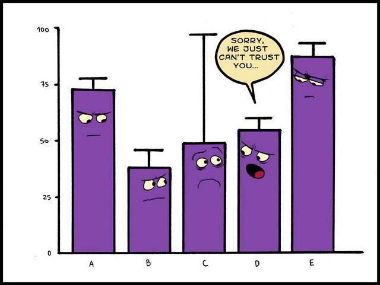
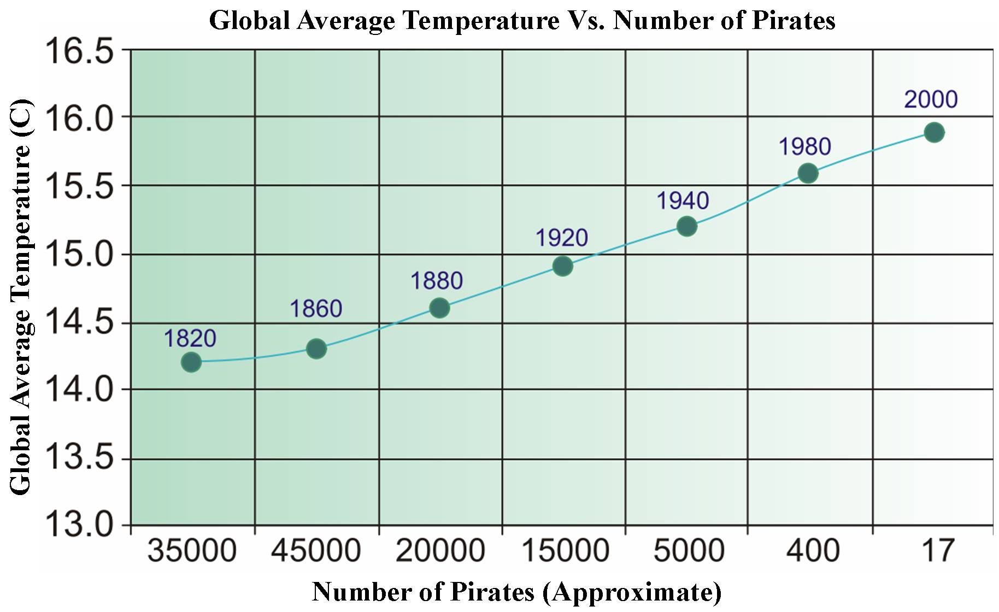
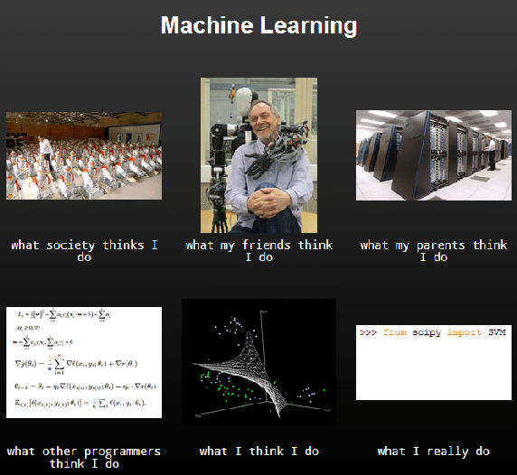
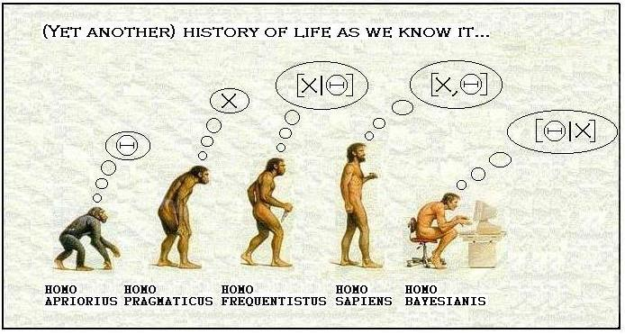
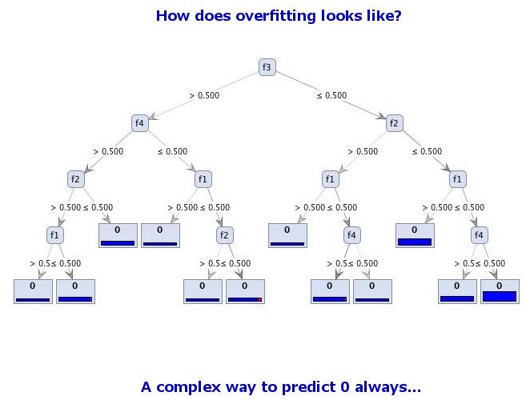
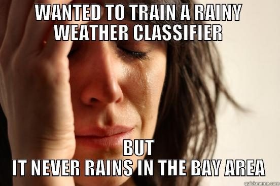

The following are funny picutures related with machine learning or data science I found online. It is a great way to learn some concepts. Also, it is nice to use some of them in your talk so that students can learn something in a very relaxed environment. 

### Torture your data
 

### Big data is like teenage sex
 

### No trust of large uncertainty
 

### Correlation does not imply causation 
 

### Type I and Type II error
 

### Out lier!
 

### Machine learning protests

### Different views of machine learning

### Hisotry of life

### Your product vs. apple and google

### Good code vs. bad code

### How deos overfitting looks like?

### Developers are born brave

### It never rains in the Bay Area

### Deep learning is easy

### The deep learning Saga
<iframe width="560" height="315" src="https://www.youtube.com/embed/mlXzufEk-2E" frameborder="0" allowfullscreen></iframe>

## Acknowledgements
All the figures are from internet, I thank all the authors.   

http://www.quertime.com/article/30-really-funny-siri-responses-to-weird-questions/

http://www.oneweirdkerneltrick.com/

https://www.quora.com/What-are-some-good-machine-learning-jokes

http://www.kdnuggets.com/2012/12/machine-learning-data-mining-humor.html

https://www.analyticsvidhya.com/blog/2015/12/hilarious-jokes-videos-statistics-data-science/

http://stats.stackexchange.com/questions/423/what-is-your-favorite-data-analysis-cartoon

